# 100_days_of_computer_vision

This repository contains the codes for **100 days of computer vision** challenge. I pursue this challenge with a focus on concepts of 3D & 2D Computer vision (and thus, some concepts in computer graphics). The challenge is inspired by the [100 Days of Code](https://www.100daysofcode.com/) challenge. 

## Covered Topics
1. __PyTorch3D__:
   
   Please refer to [this readme file](Pytorch3D/README.md) for in-depth information on the implemented projects with PyTorch3D. The covered projects are:

      1. [Rendering a textured mesh](Pytorch3D/notebooks/render_textured.ipynb) 

         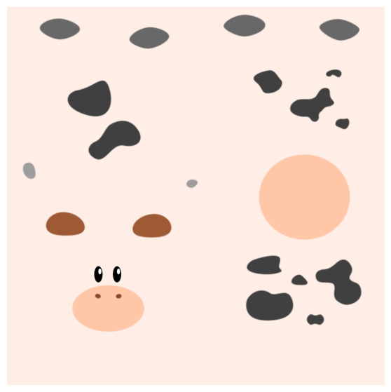

         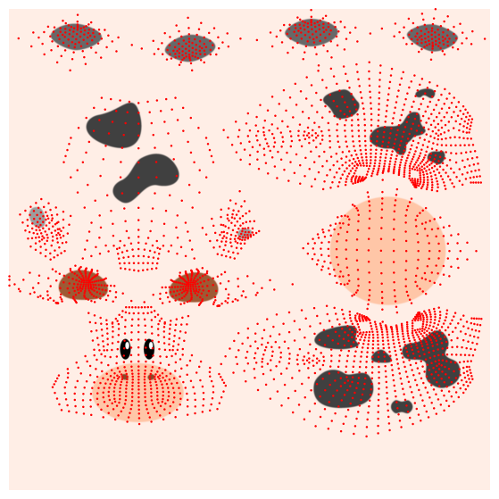

         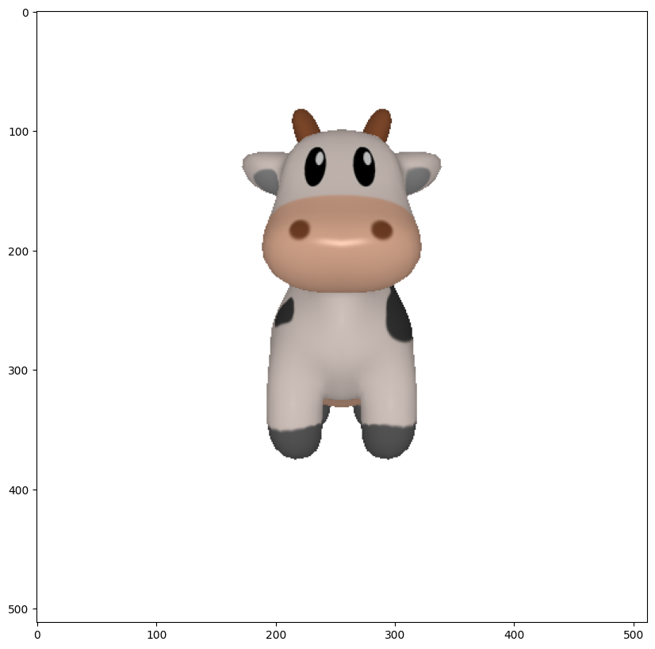

      3. [Rendering a dense pose](Pytorch3D/notebooks/render_dense_pose.ipynb)

         

         

      5. [Deforming a base mesh and optimizing to get to the target mesh](Pytorch3D/notebooks/deform_to_fit.ipynb)

         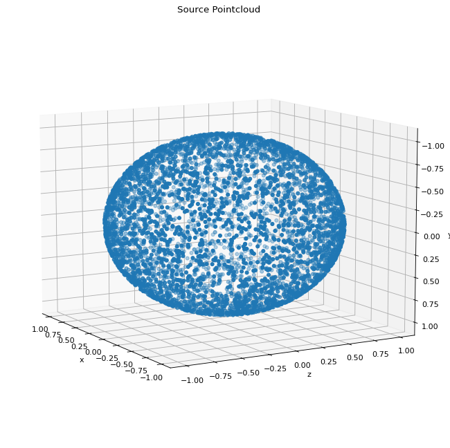

         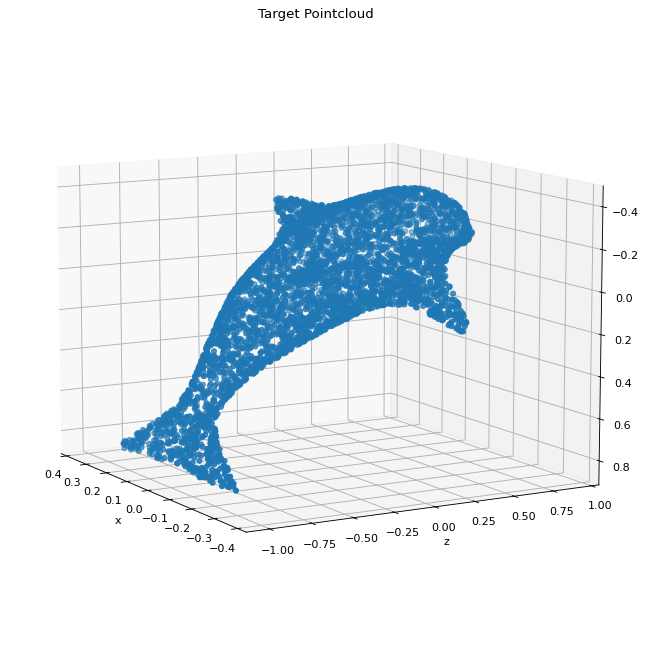

         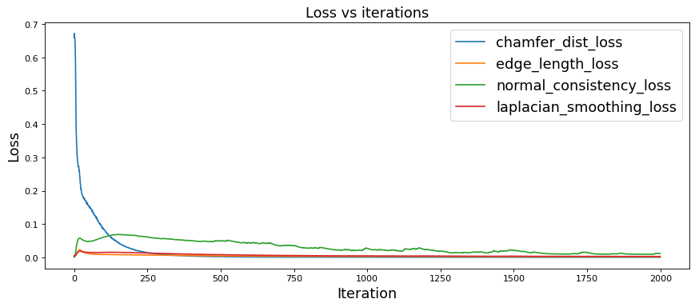
         
         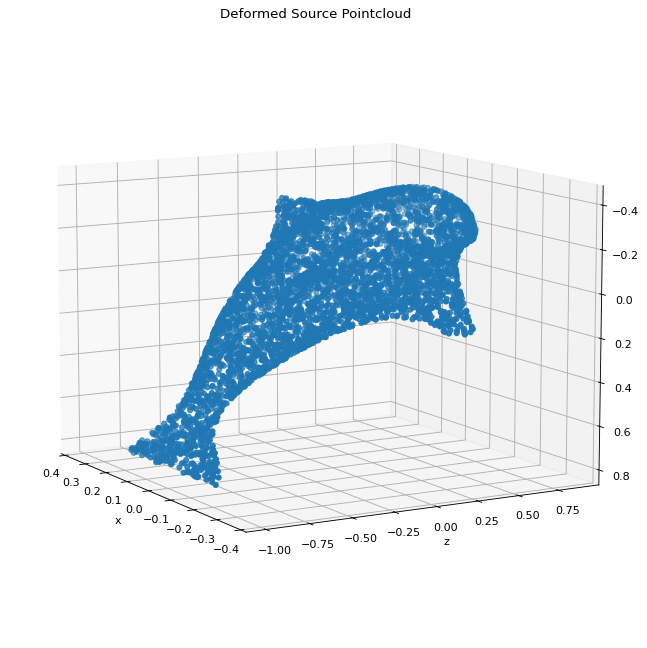
      

2. __From Scratch Projects__:
  
    Please refer to [this readme file](FromScratch/README.md) for in-depth information on the implemented projects from scratch. The covered projects are:

   1. [Image Formation](FromScratch/Image_Formation/main.py)
      
      
   
   2. [ViT from scratch](FromScratch/ViT/main.ipynb)
   
      Making patches as tokens from an input image:

      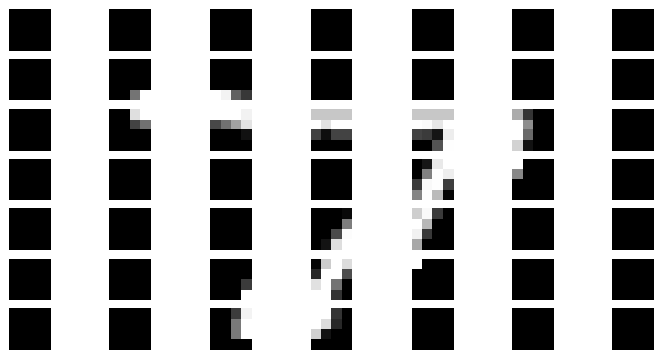

      Visualizing Positional Embedding:

      

      Testing the predictions of classifier:

      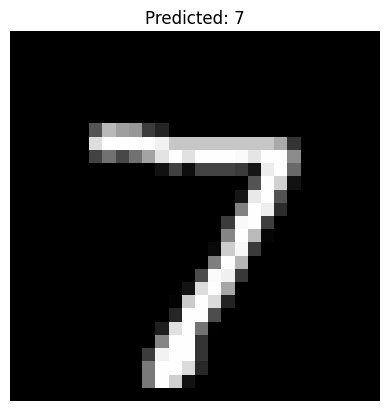

   3. [VAE From Scratch](FromScratch/VAE/main.ipynb)

      A sample from the final trained VAE (on Mnist):

      

      Generating 25 samples:

      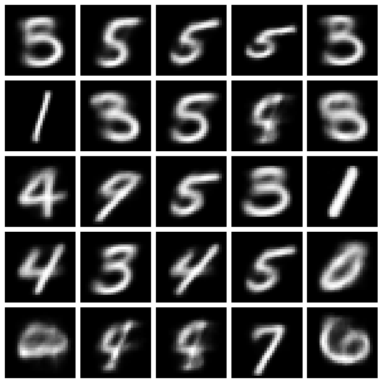

      Visualizing the distribution of generation in the trained VAE:

      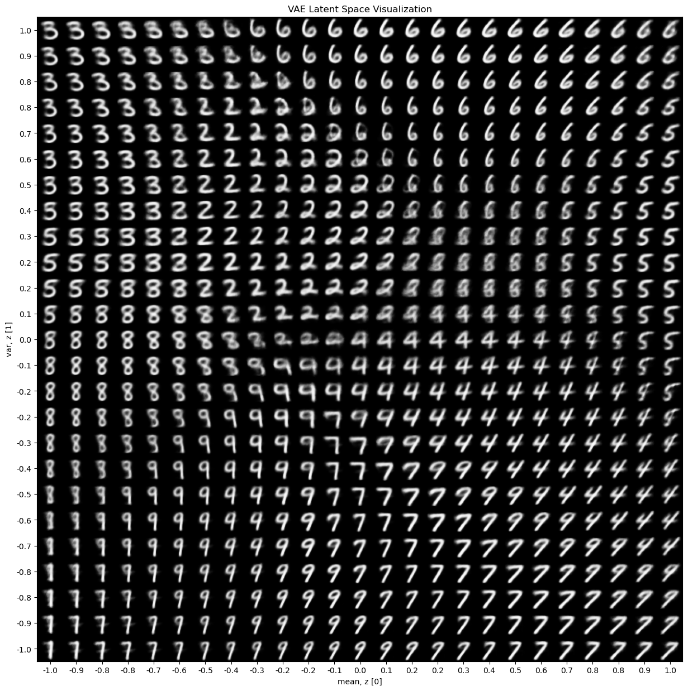

   4. [Spherical Harmonics From Scratch](FromScratch/Spherical_Harmonics/main.ipynb)

      Vectors on the surface of a sphere:

      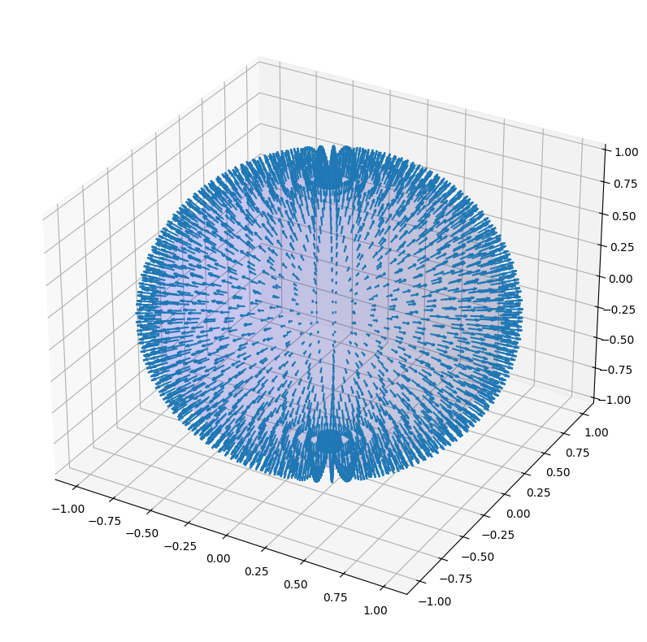

      Legendre Polynomials:

      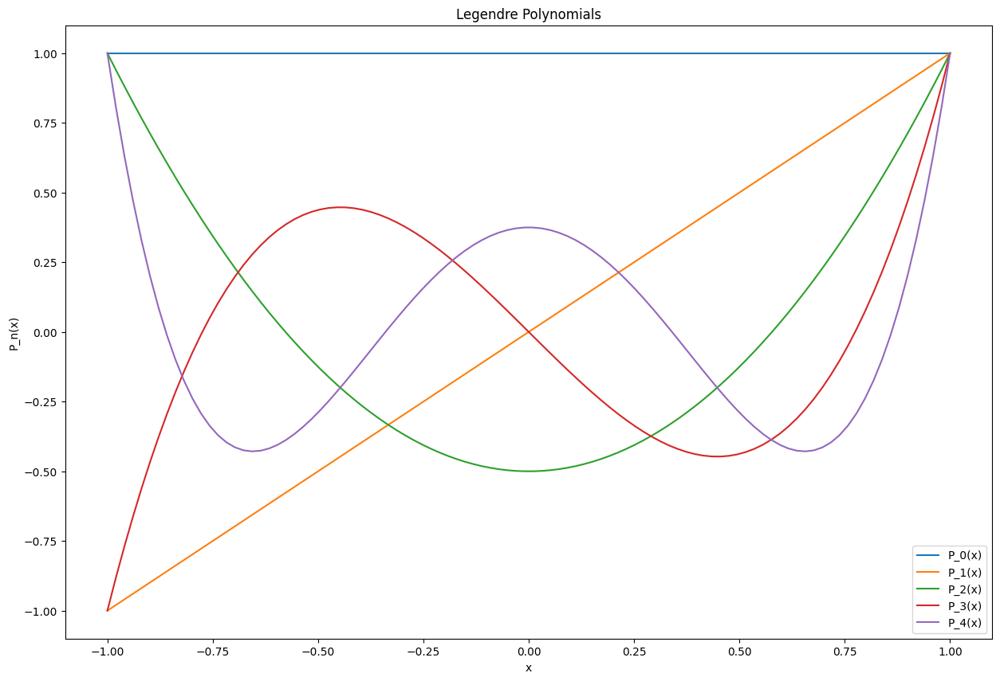

      Spherical Harmonics with $l=1$ and $m=-1$:
      ...
      
      Spherical Harmonics with $l=1$ and $m=0$:
      ...
      
      Spherical Harmonics with $l=1$ and $m=1$:
      ...
      
   5. [Grid Encoding (like InstantNGP) From Scratch](FromScratch/Grid_Encoding/3d_grid.ipynb)
   
      A sample 3D grid (sampled points):

      

      A sample point $\bar{x}=(x, y, z)$ and it's nearest voxel:

      

      Then the point's encoding is calculated as the __Linear interpolation__ of the 8 nearest voxels. For the training process, please refer to the [notebook](FromScratch/Grid_Encoding/3d_grid.ipynb).

   6. [RGB Prediction Using Spherical Harmonics](FromScratch/Spherical_Harmonics/main.ipynb)

      The RGB prediction using Spherical Harmonics:
      
   7. [Tiny Renderer from Scratch](FromScratch/Tiny%20Renderer/main.cpp)
   
      This is a C++ implementation of a tiny renderer. I made it to play around with the concepts of comuter graphics and the most important focus here is __rasterization__. I took the guidances of the [tinyrenderer](github.com/ssloy/tinyrenderer) repository.

      Rendering simple line segments (without anti-aliasing):
      ```Cpp
      void line(int x0, int y0, int x1, int y1, TGAImage &image, TGAColor color);
      ```

      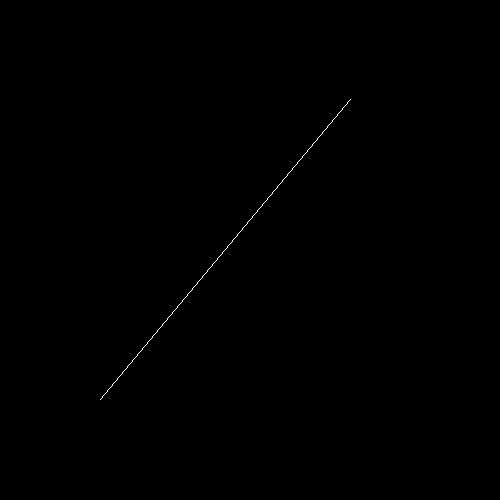

      Rendering an `obj` model:
      ```Cpp
      void wireframe_obj(Model &model, TGAImage &image, TGAColor color);
      ```

      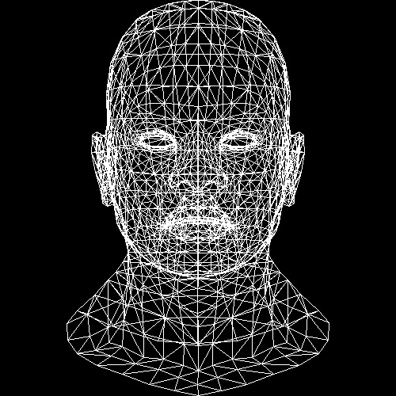

      Rasterizing a triangle (only contours):
      ```Cpp
      void triangle_contour(Vec2f t0, Vec2f t1, Vec2f t2, TGAImage &image,
                      TGAColor color);
      ```

      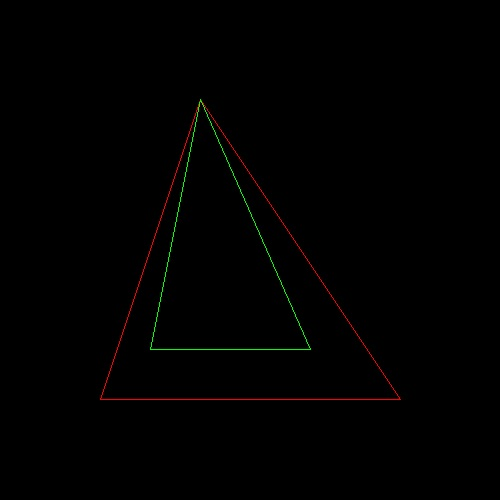

      Rasterizing a triangle (filled):
      ```Cpp
      void triangle(Vec2i t0, Vec2i t1, Vec2i t2, TGAImage &image, TGAColor color);
      ```

      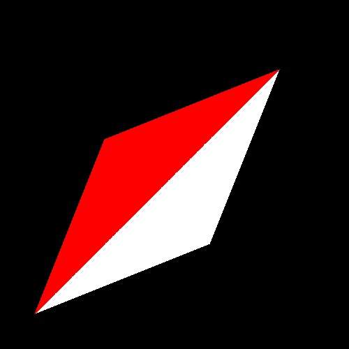

   8. [Diffusion model from scratch](FromScratch/Diffusion/main.py)
   ...